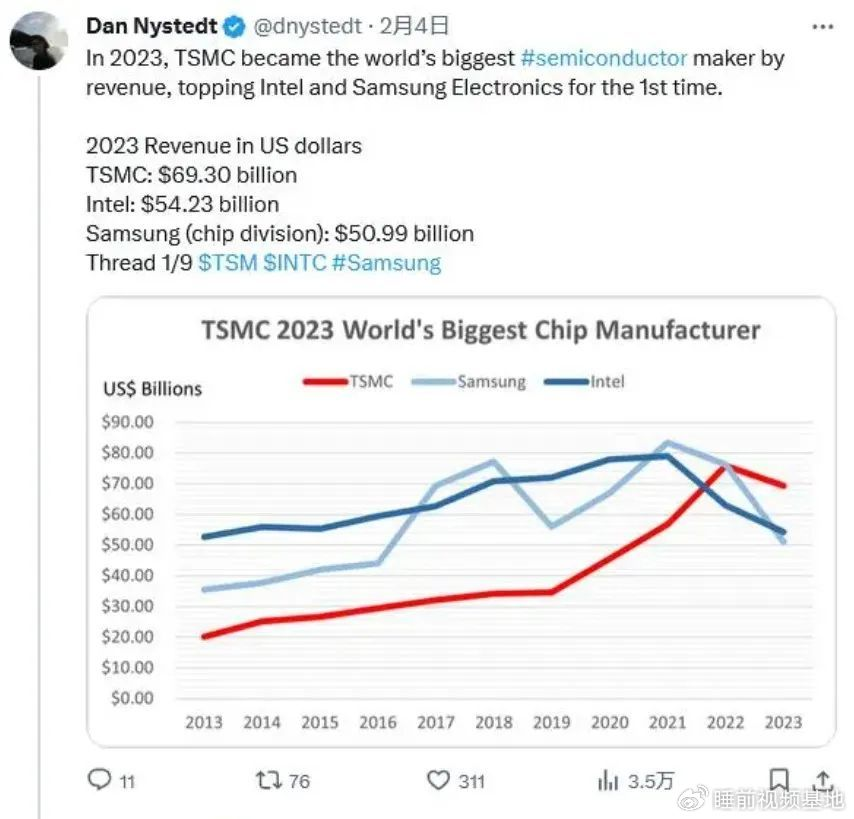

# 二月

1.
- 美国表示，愿意支持独立的巴勒斯坦国

2.
- 年内全国免助学贷款利息
- 上证指数一度跌至2666  勉强守住2700
- 药明康德拟回购10亿元股份并注销：维护公司价值及股东权益
- 德意志银行拟裁员3500人

3.
- 房企金茂集团公开招标舆情监控业务 要求监控业主群
- 串通国防科技大学下属单位  麒麟信安被禁止参与军队采购
- 五百亿美元回购+首次分红！Meta市值一天涨20%

4.
- 中央农办：正研究产粮食销区省际横向利益补偿机制的具体实施办法
- 部分煤企“宁肯交罚款也要违法生产”？国家矿山安监局拟提高罚款数额下限
- 多家出险房企宣布旗下项目进入融资白名单：已超70个 碧桂园超过30个

5.
- 涉及170个城市，超3000房地产项目入围融资“白名单”
- 去年中国汽车进口量创自2010年以来的新低
- 全球首个:埃塞俄比亚宣布禁止进口非电动汽车，当地高官称无力进口汽油

6.
- 青岛国资城投34亿买上市公司，2天市值减半
- 中央汇金国家队出手 A股反弹
- 从成本上说，摩尔定律可能已经失效

7.
- 证监会换领导
- 台湾可能叫停来大陆旅行团

8.
- 美国确认：墨西哥成美国进口货物最大来源国
- 台积电已经是全球最大半导体制造商

    

- 贵阳银行“踩雷”正威集团 16亿元敞口纳入不良

9.
- 食品企业内部人实名举报，最高拟奖100万
- 恩捷股份辟谣：云南首富没有跑路美国，本来就是美国籍

12.
- 美国股市总市值是中国五倍 差距达到历史高点
- 黑龙江公布经济策略：以旅游及康养业带动房地产业
- 小米在印度发声：鉴于印政府对中企严格审查，零部件供应商对在印建立业务持忧虑态度

13.
- 美参议院通过950亿美元对外军援法案，涉乌克兰、以色列
- 欧盟决定利用俄央行冻结资产利润援乌
- 比特币达到五万美元
- 全球芯片股暴涨，英伟达市值一度超越亚马逊和谷歌
- 拜登注册TikTok账号

15.
- 阿里巴巴2023年员工减少约2万人 两年内减员大约4万人
- 没人为情怀付钱 宝马高价手动挡计划即将结束
- 德国gdp确认再次超过日本

16.
- OpenAI发布文字生成复杂视频模型Sora 颠覆文化产业规则

17.
- 美国考虑补贴英特尔100亿美元以上
- 春节档总票房78.44亿，破历史纪录

18.
- 湖南省委要求解放思想大讨论：县处级以上单位开展，3月底结束
- 山东书记：山东比以往何时都更需要扩大开放、狠抓招商
- 春节假期前8天江苏文旅消费达170多亿元，全国第一
- 阿根廷政府一月份实现财政盈余 12年来首次
- 世卫组织总干事：下一次大流行病暴发只是时间问题
